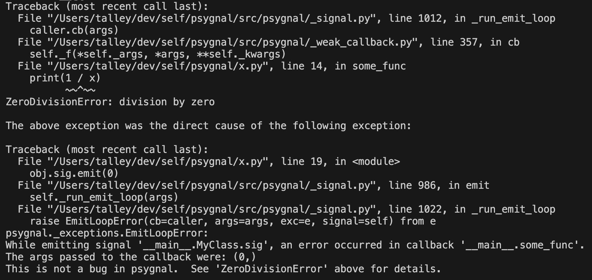
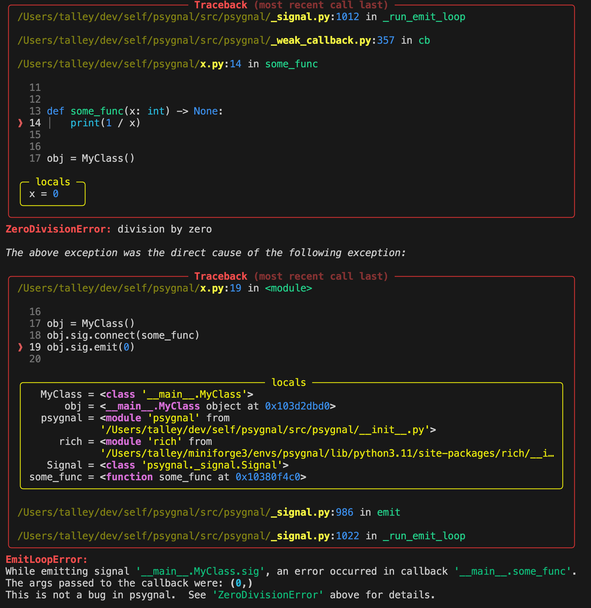

# Tips for Debugging

When using any library that deals with callbacks, it can sometimes be difficult
to debug issues that occur in the callbacks.  This is because the stack trace
that you see when the error occurs has a number of additional frames that are
not relevant to the error, but rather are part of the psygnal's callback
handling logic.

## Using `rich` to Improve Stack Traces

The library [rich](https://rich.readthedocs.io/en/latest/) provides a convenient
way to [suppress these irrelevant
frames](https://rich.readthedocs.io/en/stable/traceback.html#suppressing-frames)
and highlight only the relevant ones, making it *much* easier to determine which
part of your code is causing the error.

### Example

Take the following code that runs into a `ZeroDivisionError`
inside of callback `some_func`, when the signal `obj.sig` is emitted
with the value `0`:

```python
from psygnal import Signal

class MyClass:
    sig = Signal(int)

def some_func(x: int) -> None:
    print(1 / x)

obj = MyClass()
obj.sig.connect(some_func)
obj.sig.emit(0)
```

Here's an example of a standard Python (3.11) stack trace that you
might see when running this code:

[](../img/stdlib.png)

All the information is there, but you need to ignore all the
lines that come from psygnal, and focus on the lines that come from your
own code. That can be visually challenging, especially if the stack trace is
longer than this one.

Now, add the following code somewhere at the top of your program:

```python
import rich.traceback
import psygnal
rich.traceback.install(show_locals=True, suppress=[psygnal])
```

If you run the code again, you'll see a much more helpful stack trace.

In addition to coloring the output, providing `suppress=[psygnal]` reduces info
from frames that are part of the psygnal library, making it much
easier to see where the error occurred in your own code.  Specifically, it draws
attention to the two places in the code that you can do something about:

1. The line in the callback that caused the error: `print(1 / x)`
2. The emission of the event that triggered the callback: `obj.sig.emit(0)`

[](../img/rich.png)
